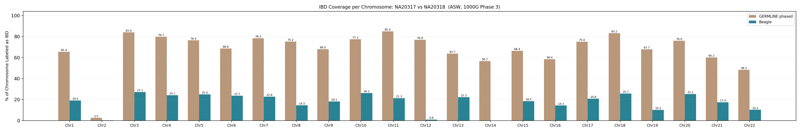
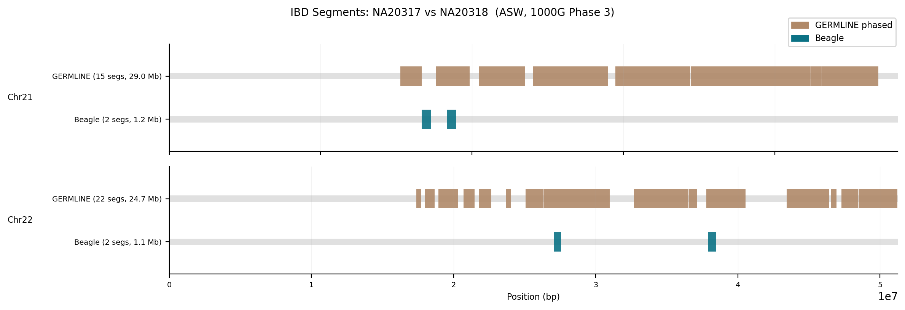
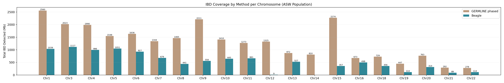
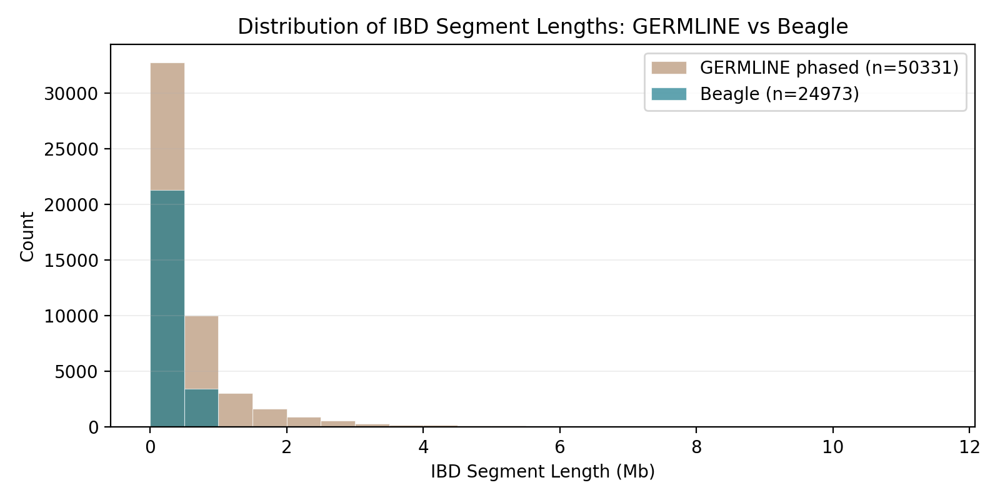

# Detecting IBD Segments: germline2 vs Beagle

**CSE 284 – Personal Genomics, UCSD WI26**
**Authors:** Abishai Ebenezer (A69045190), Inna Amogolonova (A16725376)
**Option 2:** Apply two or more methods and compare on real data

---

## What This Project Does

We compare two tools for detecting Identity-by-Descent (IBD) — genomic segments shared between individuals because they descend from a common ancestor:

- **germline2** — finds IBD by exact haplotype matching
- **Beagle 4.1** — finds IBD using a probabilistic hidden Markov model

We run both tools on the **ASW population** (61 individuals of African ancestry) from the 1000 Genomes Project, across all 22 autosomes. Both tools take all 61 individuals as input and compare every possible pair — that's 1,830 pairs — to find shared segments across the genome. To validate, we then pull out the results for a known mother-child pair (**NA20317 → NA20318**) confirmed from the 1000G pedigree. A parent-child pair should show extensive genome-wide IBD sharing, so this relationship provides a useful sanity check for whether each method recovers an obvious first-degree relationship.

---

## Quickstart

```bash
# 1. One-time setup: installs conda env, germline2, and Beagle
bash setup.sh

# 2. Activate the environment
conda activate cse284-ibd

# 3. Run on all autosomes
bash run_full.sh --chromosomes all

# 4. Or run on specific chromosomes
bash run_full.sh --chromosomes '13 22'
```

`setup.sh` handles everything: downloads the Beagle jar, clones and compiles germline2 from source, creates the conda environment, and downloads the 1000G metadata files. The pipeline itself downloads chromosome VCFs automatically on first run.

If no `--chromosomes` argument is given, the pipeline runs **chromosome 22 only**. Use `--chromosomes all` for the full autosomal analysis.

**System requirements:** Linux, conda, Java 8+, gcc, make, wget

---

## Data

- **Source:** 1000 Genomes Project Phase 3 (pre-phased by SHAPEIT2)
- **Population:** ASW — 61 individuals of African ancestry in Southwest USA
- **Chromosomes:** All 22 autosomes (biallelic SNPs only)
- **Validation pair:** NA20317 (mother) → NA20318 (child)

---

## How the Pipeline Works

For each chromosome, `run_full.sh` does the following:

1. Downloads the 1000G Phase 3 VCF (if not already present)
2. Subsets to the 61 ASW samples and filters to biallelic SNPs
3. Converts the phased VCF to HAPS/SAMPLE format for germline2
4. Runs germline2 in haploid mode
5. Runs Beagle IBD detection
6. Summarizes results and generates figures

All steps are idempotent — safe to re-run.

The pipeline also extracts all parent-child relationships present in the 1000 Genomes pedigree into `data/processed/parent_child_pairs.tsv`. This file is used to confirm that the validation pair (`NA20317` and `NA20318`) is a known mother-child relationship and provides a simple record of the pedigree-derived parent-child pairs available in the dataset.

## Methods / Parameters

- **germline2** was run in haploid mode with `-h -m 1`
- **Beagle 4.1** was run with `ibd=true ibdcm=0.3 ibdlod=2.0`
- Input data were phased 1000 Genomes Phase 3 VCFs restricted to ASW samples and biallelic SNPs

---

## Key Results

We validate both tools on the known mother-child pair. A true parent-child relationship should show extensive IBD sharing across every chromosome, so we use this pair as a validation signal while also comparing segment counts and overlap.

**Across all autosomes (NA20317 → NA20318):**

| Method | Avg. chr covered |
|---|---|
| germline2 | 67.9% |
| Beagle | 17.6% |

The autosome-average Jaccard overlap between the two callsets is **21.2%**, indicating that the methods often identify different segment boundaries even when they detect IBD in the same parent-child pair.

germline2 detects substantially more IBD in the parent-child pair. The low Jaccard reflects algorithmic differences: germline2 uses exact haplotype matching and tends to call longer, more liberal segments, while Beagle's HMM is more conservative.

Full per-chromosome results: [`results/summary/parent_child_check.tsv`](results/summary/parent_child_check.tsv)

In `parent_child_check.tsv`, the final row labeled `autosome_avg` reports the average coverage and overlap statistics across chromosomes 1-22 for the validation pair.

**IBD coverage across all autosomes (germline2 vs Beagle):**


**Genome-wide karyogram — shared segments on each chromosome:**


### Example chromosomes

| Metric | germline2 | Beagle |
|---|---|---|
| **Chr13** — parent-child segments | 34 | 61 |
| **Chr13** — parent-child IBD | 73.4 Mb (63.7% of chr) | 25.6 Mb (22.3%) |
| **Chr22** — parent-child segments | 22 | 12 |
| **Chr22** — parent-child IBD | 24.7 Mb (48.3% of chr) | 5.2 Mb (10.2%) |

**Total IBD detected per chromosome (all pairs):**


**IBD segment length distribution:**


---

## Output Files

``` 
data/
└── processed/
    └── parent_child_pairs.tsv  # extracted parent-child relationships from the 1000G pedigree

results/
├── chr{N}/
│   ├── asw_germline2.match     # germline2 IBD segments
│   └── asw_beagle.ibd.gz       # Beagle IBD segments
├── summary/
│   └── parent_child_check.tsv  # per-chromosome stats for the validation pair
└── figures/
    ├── genome_karyogram_NA20317_NA20318.png   # IBD segments across all autosomes
    ├── ibd_coverage_pct_NA20317_NA20318.png   # per-chromosome IBD coverage %
    ├── method_overlap.png                      # total IBD per chromosome per method
    └── seg_length_hist.png                     # IBD segment length distributions
```

`parent_child_pairs.tsv` contains four columns: `population`, `parent`, `child`, and `relationship` (`father-child` or `mother-child`). In this project, we use it to verify that `NA20317 -> NA20318` is a known parent-child pair before comparing the IBD calls from germline2 and Beagle.

`parent_child_check.tsv` reports one row per chromosome for `NA20317 -> NA20318`, followed by a final `autosome_avg` row that summarizes the average chromosome coverage and overlap metrics across all autosomes.

---

## LLM Usage

Claude (Anthropic) was used to assist with Python and shell script development and documentation. Analysis design, method selection, parameter choices, and scientific interpretation were done by the project authors.
